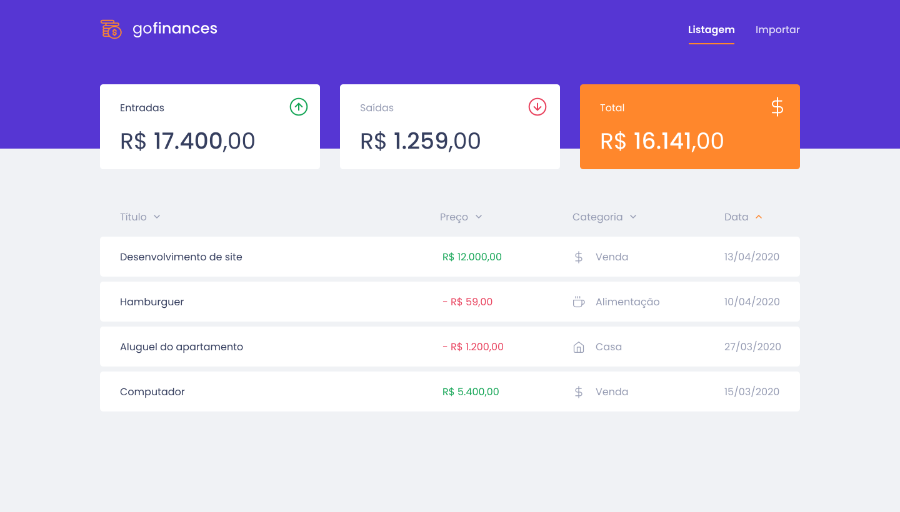
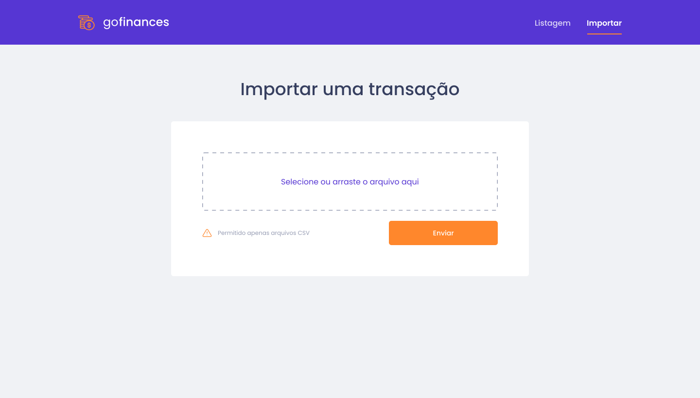

<h1 align="center">

</h1>

<p align="center">A complete stack application (API REST, Web and Mobile) designed to control your expenses. It supports importing CSV files to insert a larger amount of data.</p>

<p align="center" color="">
  
  
  
  
  <a href="https://github.com/pjavier98/gofinances/commits/master">
    
  </a>
  
  <a href="http://makeapullrequest.com">
    
  </a>

  <a href="https://opensource.org/licenses/MIT">
    
  </a>
</p>

<hr />
<h2>Web</h2>


<br />
<br />



<hr />

<h2>Mobile</h2>
In progress...


## Features

This app features all the latest tools and practices in web development!

- [Node.js](https://nodejs.org/)
- [ReactJS](https://reactjs.org/)
- [React Native](https://reactnative.dev/)
- [TypeScript](https://www.typescriptlang.org/)
- [TypeORM](https://typeorm.io/#/)
- [Express](https://expressjs.com/pt-br/)
- [PostgreSQL](https://www.postgresql.org/)
- [Jest](https://jestjs.io/)
- [SuperTest](https://github.com/visionmedia/supertest)
- [React Router DOM](https://reacttraining.com/react-router/)
- [React Navigation](https://reactnavigation.org/)
- [React Icons](https://react-icons.netlify.com/#/)
- [Styled Components](https://styled-components.com/)
- [Axios](https://github.com/axios/axios)
- [Eslint](https://eslint.org/)
- [Prettier](https://prettier.io/)
- [EditorConfig](https://editorconfig.org/)

## Getting started

### Requirements
* Node.js
* Yarn
* PostgreSQL
* Docker

**Clone this repo using:**
```
$ git clone https://github.com/pjavier98/gofinances.git
```
**Move to the appropriate directory:**
```
$ cd gofinances
```
### Backend
```
# From the project root, enter the backend folder
$ cd backend

# Install the dependencies
$ yarn

# Have a PostgreSQL database running, example:
$ docker run --name gofinances-postgres -e POSTGRES_USER=docker -e POSTGRES_PASSWORD=docker -e POSTGRES_DB=gofinances -p 5432:5432 -d postgres

# Perform the migrations
$ yarn typeorm migration:run

# Everything ready to start the server
$ yarn dev:server
```

### Web
Before running, remember to start the backend for this project
```
# From the project root, enter the web frontend folder
$ cd web

# Install the dependencies
$ yarn

# Everything ready to start the client
$ yarn dev:server
```
## Contributing

Please read [CONTRIBUTING.md](CONTRIBUTING.md) for details on our code of conduct, and the process for submitting pull requests.

## License

This project is licensed under the MIT License - see the [LICENSE.md](LICENSE.md) file for details.